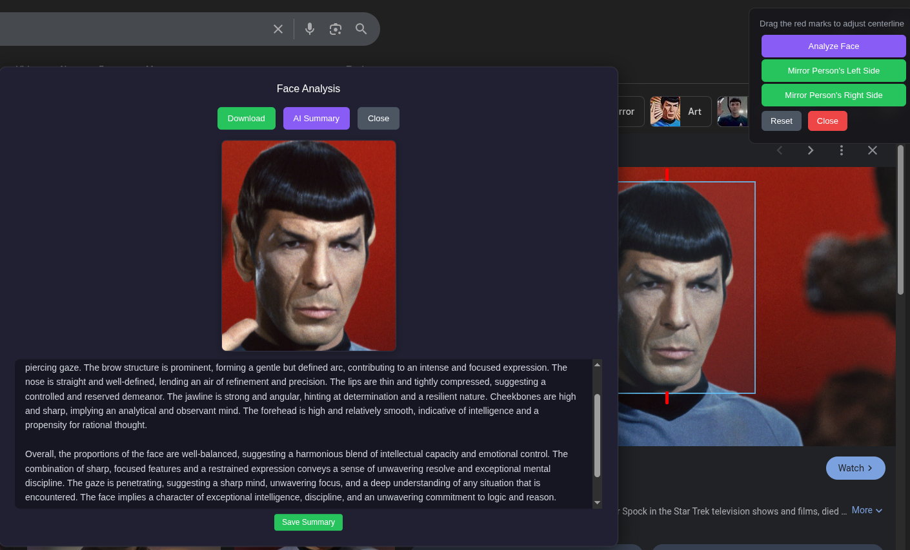

# Phisognomous

A Chrome extension for facial symmetry analysis and AI-powered physiognomic readings.

I was inspired to create it by watching ProsopaInsights on YT and thought it would be a fun thing to have for experimentation. What started as a simple mirroring tool has grown into something more — it now includes AI-driven face readings based on the physiognomic frameworks of Peter S. Reznik and Judith A. Hill, with side-specific analysis and downloadable summaries.

I'm not a programmer and this was made using Claude at my direction. So if you think you can make a better tool then please do and let me know.

## Features

- **Face mirroring** — Draw a box around a face, set a centerline, and mirror either the left or right side to create a perfectly symmetrical version. Labels use the person's left/right (not the viewer's).
- **AI physiognomic reading** — Send the captured face (original or mirrored) to Google Gemini for a character and temperament reading based on visible facial features. Side-specific readings interpret the mirrored half through the lens of inner/emotional self (left) vs. outer/public self (right).
- **General face analysis** — Analyze the unmirrored face for an overall reading of features, proportions, and what they suggest.
- **Save Summary** — Download the AI reading as a plain text file.
- **Image download** — Save mirrored or analyzed face images as PNGs.
- **Works on YouTube and other video sites** — Uses tab capture to handle cross-origin and DRM-protected content.

## Installation

1. **Git clone this repo or download the zip**
2. **Go to your hamburger menu in your Chrome or Chrome-based browser and click on Extensions > Manage Extensions**
3. **Flip on Developer Mode**
4. **Click Load Unpacked and direct it to where you cloned the files**

## Usage

1. Click on the extension icon and hit "Activate Tool"
2. Click and drag to draw a box around a face — two red tick marks appear at top and bottom for setting the centerline
3. Drag the tick marks to fine-tune the centerline (try to keep it as centered as possible for best results)
4. Choose **Mirror Person's Left Side** or **Mirror Person's Right Side** to see the symmetrical version
5. Hit **Analyze Face** for a general AI reading of the unmirrored face
6. On any result, click **AI Summary** for a physiognomic reading, or **Download** to save the image
7. Use **Save Summary** to download the AI reading as a text file

## AI and Privacy

The AI features send the selected image to Google Gemini **using your own API key** — set it in the extension popup under Settings. This may incur API charges depending on your account and usage. Use Google Cloud quotas/budgets to cap spending, and only proceed when you are comfortable with the prompt. A confirmation dialog appears before every AI call.

## Additional Notes

- **I made it for faces but I spose you can use it for other mirroring too**
- **Does tend to make some funny results**
- The AI readings draw on traditional physiognomic frameworks and are for entertainment/educational purposes

## Contributing

Issues and improvements welcome. This tool was built collaboratively with AI assistance.
